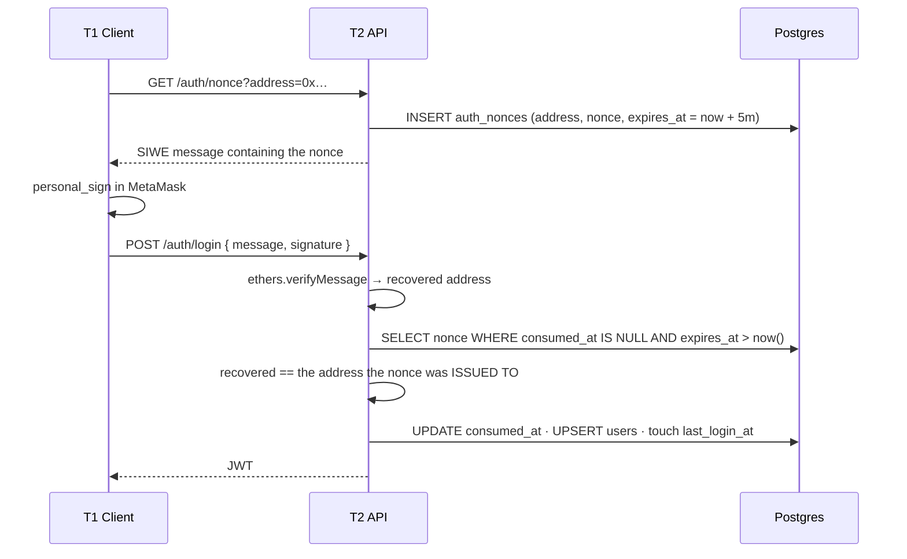
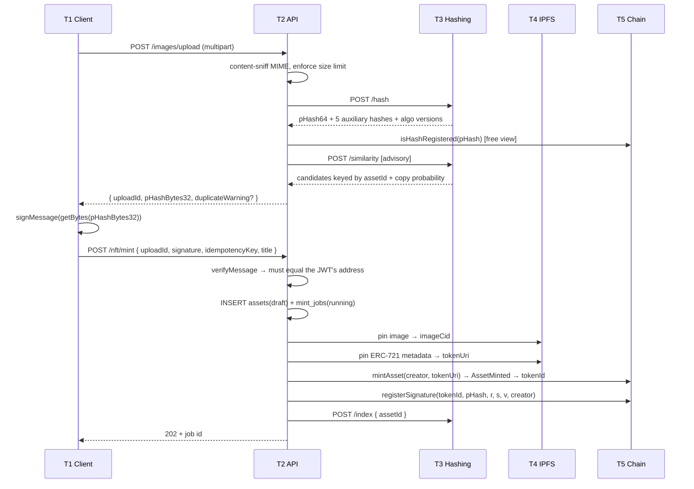
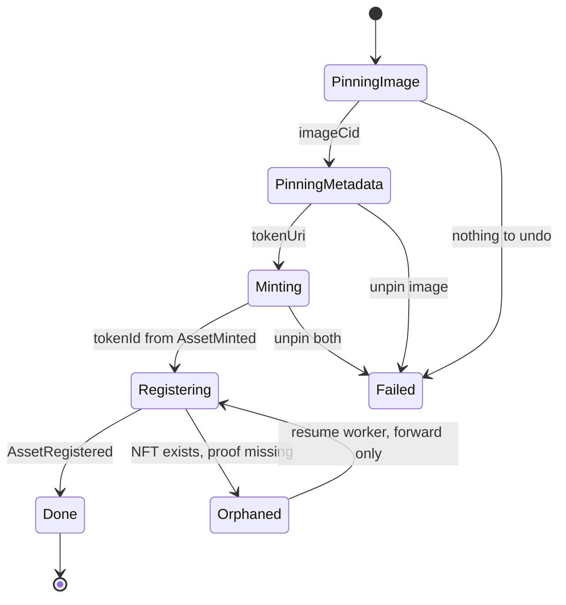

# System Design — DAM Platform

**Status:** Proposed · **Date:** 2026-07-24 · **Supersedes:** the 2026-07-22 data-model draft
**Grounded in:** the three contracts deployed and verified on Polygon Amoy

This document describes the whole system, not just the backend. It is written *upward from
the deployed contracts*: every decision below is either forced by contract code that already
exists on chain, or is explicitly labelled as a choice.

The previous draft assumed a hashing service that could sign Ethereum messages and a
Postgres-side similarity search. Neither is true. Both assumptions are corrected here.

---

## 1. Five tiers

```
┌─────────────────────────────────────────────────────────────────┐
│ T1  CLIENT            Next.js + MetaMask                        │
│                       Holds the only private key that matters.  │
│                       Signs the login nonce and the pHash.      │
└────────────────────────────┬────────────────────────────────────┘
                             │ HTTPS / JWT
┌────────────────────────────▼────────────────────────────────────┐
│ T2  API GATEWAY       NestJS  ·  owns Postgres                  │
│                       Auth, orchestration, saga durability,     │
│                       projection of chain state.                │
│                       Pays gas. Holds no user key.              │
└───────┬──────────────────┬─────────────────────┬────────────────┘
        │ HTTP             │ HTTPS               │ JSON-RPC
┌───────▼────────┐ ┌───────▼─────────┐ ┌─────────▼────────────────┐
│ T3  HASHING    │ │ T4  CONTENT     │ │ T5  CHAIN                │
│  FastAPI       │ │  IPFS / Pinata  │ │  Polygon Amoy (80002)    │
│  Pure compute: │ │  Image bytes +  │ │  DAMAsset                │
│  pHash,        │ │  ERC-721        │ │  DAMSignature            │
│  similarity    │ │  metadata JSON  │ │  DAMVerifier             │
│  Stateless wrt │ │                 │ │  SOURCE OF TRUTH         │
│  business data │ │                 │ │                          │
└────────────────┘ └─────────────────┘ └──────────────────────────┘
```

| Tier | Owns | Never does |
|---|---|---|
| **T1 Client** | The creator's private key | Talk to T3/T4/T5 directly |
| **T2 API** | Postgres, the saga, the service wallet | Hold a user key; decide ownership |
| **T3 Hashing** | Hash algorithms, the similarity model + its index | Sign anything; know about tokens or wallets |
| **T4 Content** | Image bytes, metadata JSON | Anything mutable |
| **T5 Chain** | Ownership, authorship, uniqueness | Anything requiring a query |

**The one invariant:** T5 is authoritative for *who owns* and *who created*. T2's database is
a projection. Any response asserting ownership is either read live from T5, or returned with
the block height it was reconciled at.

---

## 2. What the deployed contracts already decided

These are not open questions. The bytecode is on Amoy and cannot be changed without a
redeploy, so the rest of the design is downstream of them.

### 2.1 The creator signs — not the service

[`DAMVerifier.verifySignatureView`](../contracts/contracts/DAMVerifier.sol#L60-L75) recovers
the signer from the stored signature and compares it to `asset.creator`:

```solidity
bytes32 ethSignedHash = MessageHashUtils.toEthSignedMessageHash(asset.perceptualHash);
address recovered = ECDSA.recover(ethSignedHash, signature);
return (recovered == asset.creator);
```

So `creator` must be whoever produced the signature. If a service key signed, then `creator`
would have to be the *service address*, and "proof of authorship" would prove only that our
own server saw the image. That is not a product.

→ **T1 signs the pHash in MetaMask.** The old open question "who signs?" is closed.
Corroborating: the hashing service has no signing capability at all — no `eth_account`, no
`web3` in `requirements-deploy.txt`, and the `PRIVATE_KEY` in its `.env.example` is unused.

### 2.2 The exact signing format

`toEthSignedMessageHash(bytes32)` produces `keccak256("\x19Ethereum Signed Message:\n32" ‖ h)`.
To match it, the client must sign the **32 raw bytes**, not the hex string:

```typescript
// CORRECT — prefix length is 32
await signer.signMessage(ethers.getBytes(pHashBytes32));

// WRONG — prefix length becomes 66, verification fails forever
await signer.signMessage(pHashBytes32);
```

This is the format the contract tests already use
([DAM.test.ts:23-25](../contracts/test/DAM.test.ts#L23-L25)). Getting it wrong produces a
signature that is permanently unverifiable and, because the pHash slot is consumed on
registration, **unrecoverable without a new image**.

### 2.3 pHash packing is fixed at 64 bits

`registerSignature` takes one `bytes32`. The canonical value is the 64-bit `PerceptualHash`
output, packed right-aligned into 32 bytes per `boolArrayToBytes32`
([contracts/README.md](../contracts/README.md)) — the 64 bits occupy the low 8 bytes, the
high 24 bytes are zero.

The other five algorithms (`ahash`, `dhash`, `hsv`, `rhash`, `chash`) never touch the chain.
They exist only to feed the similarity model, and their bit lengths differ from 64 — see §6.

### 2.4 Anyone can call the mint and register functions

Neither `mintAsset` nor `registerSignature` is access-controlled.
[`DAMAsset`](../contracts/contracts/DAMAsset.sol#L12) imports `Ownable` but gates nothing
with it. Consequences:

- T2 can use any funded wallet; it need not be the deployer.
- `mintAsset(creator, uri)` calls `_safeMint(creator, tokenId)`, so **the NFT lands in the
  creator's wallet even though T2 paid the gas.** Custody is correct by construction.
- It also means a third party can call these. See §8 for what that costs us.

### 2.5 Uniqueness is exact-match only, and it is the real guard

| Guard | Where | Scope |
|---|---|---|
| `_registeredURIs[uri]` | [DAMAsset.sol:52](../contracts/contracts/DAMAsset.sol#L52) | exact IPFS URI |
| `_registeredHashes[pHash]` | [DAMSignature.sol:52](../contracts/contracts/DAMSignature.sol#L52) | exact 32-byte hash |
| `_signatures[tokenId]` | [DAMSignature.sol:51](../contracts/contracts/DAMSignature.sol#L51) | one signature per token |

A one-bit difference defeats all three. Near-duplicate detection is therefore **entirely
off-chain and always advisory** — the contract revert is the only real uniqueness guarantee,
and every pre-check we build must be presented as a hint, never as a promise.

### 2.6 The orphan state cannot be designed away

`registerSignature` needs a `tokenId`, which only exists after `mintAsset` is mined. The
order is forced. Once mined, an NFT is permanent and cannot be un-minted. So a failure
between the two transactions leaves a token with no proof of authorship, recoverable only by
**rolling forward**. §5.3 covers how.

---

## 3. Flow A — Sign in



Two rules that are easy to get wrong and expensive to get wrong:

1. Compare the recovered address to **the address stored on the nonce row**, never to an
   address supplied in the request body. Reversing this is the classic SIWE hole.
2. `consumed_at` is what stops replay. TTL alone does not — a stolen signature is replayable
   for the rest of the window without it.

T5 is not involved. Login is a pure T1↔T2 exchange.

---

## 4. Flow B — Register a work

This is the system's main flow and the only one that writes to the chain.



### 4.1 Why the pre-checks come before the signature

Steps 3–5 are all free (one view call, two local computations). They run *before* we ask the
user to sign and long before we spend gas. `isHashRegistered` catches the exact-duplicate
case that would otherwise revert at step 11 — after the image is pinned and the NFT minted,
which is the most expensive possible place to discover it.

The similarity check is advisory and must be labelled as such in the API contract. A clean
result is not a guarantee of originality; it is the absence of a match in our index.

### 4.2 Why the signature is verified locally first

`verifyMessage` costs nothing. `registerSignature` does **not** validate the signature on
chain (§8.1), so a malformed signature would be accepted, stored, burn the pHash slot
permanently, and then fail every subsequent `verifySignatureView`. Verifying at T2 before
step 8 is the only thing standing between a typo and an unrecoverable asset.

### 4.3 The saga



`Orphaned` is why `mint_jobs` exists as a durable row rather than in-memory state. A process
restart must not lose the knowledge that a token is minted but unproven.

Retry is safe by construction: `registerSignature` reverts on a duplicate `tokenId` or
`pHash`, so re-running a completed step is a no-op rather than a double-write.

`idempotency_key` is client-supplied and stops a double-submitted upload from minting twice.
`_registeredURIs` alone does not prevent this — pinning identical bytes twice yields the same
CID, so the second attempt reverts *at the contract*, wasting gas and surfacing an opaque
error instead of a clean 409.

---

## 5. Flow C — Verify

Two questions that share a route prefix and nothing else.

### 5.1 Ownership — "was this hash signed by this token's creator?"

```
image → T3 /hash → pHash → T5 verifySignatureView(tokenId, pHash) → bool
```

Free, live, and **never served from Postgres**. `asset_signatures` is a cache for display;
verdicts always come from T5. Public route — no JWT.

### 5.2 Similarity — "does this resemble anything registered?"

```
image → T3 /similarity → candidates (assetId, probability) → T2 joins assets → response
```

Entirely T3. T2's only jobs are to join `assetId` back to token/owner data and to write the
`verifications` audit row with the `model_version` that produced the verdict — retraining
changes past answers, and a dispute needs to know which model said what.

---

## 6. The T3 contract

The current `/hashing` code is an experimental similarity prototype, not a service contract.
Its FAISS index is keyed on filenames it assigns itself, which cannot be joined back to
anything in T2. The following is the interface T2 requires. It is smaller than the interface
`hashing/README.md` advertises, because two of those endpoints should not exist.

| Endpoint | Purpose | Notes |
|---|---|---|
| `POST /hash` | image bytes → all 6 hashes | **Missing today.** Must return per-algorithm `bits`, `bit_length`, `algo_version`, plus `phash_bytes32` packed for the chain |
| `POST /similarity` | image bytes + `k` → candidates | Must key results on the **`assetId` T2 supplied at index time**, not a filename |
| `POST /index` | `{ assetId, image }` → indexed | T2 owns the identifier. T3 stores it as the vector's metadata |
| `DELETE /index/{assetId}` | remove from index | |

**Dropped from the old contract, with reasons:**

- `POST /sign` — **removed.** T3 cannot sign (§2.1) and must not; the creator signs at T1.
- `POST /verify-ownership` — **removed.** That is `verifySignatureView` on T5. Proxying it
  through T3 adds a hop and an opportunity to answer from stale data.

**The identity rule, which is the whole point of this section:** T2 generates the `assetId`
(a UUID v7) and passes it to T3 at index time. T3 never invents identifiers that T2 has to
map back. This removes the need for any FAISS-id mapping table, and removes the failure mode
where T3 rebuilds its index, reassigns integer ids from zero, and silently invalidates every
reference T2 stored.

How T3 implements the index — FAISS, embeddings, model size — is its business, invisible to
T2, and replaceable without a schema change.

---

## 7. Data model

Eight tables. The schema of record is
[`prisma/schema.prisma`](./prisma/schema.prisma); a DBML rendering for diagramming is at
[`prisma/schema.dbml`](./prisma/schema.dbml). Hand-written DDL that Prisma cannot express —
CHECK constraints, partial indexes, the `uuidv7()` shim — is in
[`prisma/sql/init.sql`](./prisma/sql/init.sql).

| Table | Kind | Why it exists |
|---|---|---|
| `users` | operational | Join target created at first login. **Never a permission source** — authorisation is always "did this address sign?" |
| `auth_nonces` | operational | Login challenges. Keyed on address, not `user_id`: the first-ever login has no user row |
| `assets` | projection + off-chain | The row exists **before** the token does, so a mid-saga crash is recoverable |
| `asset_fingerprints` | off-chain only | Six hashes per asset; one on chain. Kept for audit and reproducibility, **not** for search |
| `asset_signatures` | mirror of T5 | Display cache. Verification never reads it |
| `mint_jobs` | operational | The saga log. Makes `Orphaned` survivable |
| `verifications` | audit | `VerificationPerformed` is emitted on chain but cannot be queried by requester or date |
| `chain_sync_cursor` | operational | Indexer bookmark, one row per contract |

Three points worth stating explicitly because they are easy to violate:

**`bit_length` is required, not padding.** The benchmark CSVs normalise distances over
different denominators per algorithm — dhash /72, hsv /42, phash /63. Only the canonical
pHash is 64-bit, because that is what gets packed for the chain. Assuming a uniform 64
silently corrupts every distance downstream and no test in the backend would catch it.

**`assets` has no `user_id` foreign key, deliberately.** The indexer writes rows for
transfers made directly on Polygonscan by wallets that never logged in. The address join is
load-bearing.

**`verifications` has no foreign key to `assets`, deliberately.** A verification may target a
token we have not indexed yet, or one minted outside this app entirely. Rejecting those would
make the audit log lie about what was asked.

### 7.1 Why not query the chain for everything

| # | Question | T5 can answer? |
|---|---|---|
| A1 | Who created token 42? | ✅ `creatorOf(42)` |
| A2 | Who owns token 42? | ✅ `ownerOf(42)` |
| A3 | Was hash *H* signed by 42's creator? | ✅ `verifySignatureView` — free |
| A4 | Has this exact pHash been registered? | ✅ `isHashRegistered` |
| A5 | List every token created by address X | ❌ `DAMAsset` is not `ERC721Enumerable`; `_creators` is one-way |
| A6 | Find assets *similar* to this image | ❌ nearest-neighbour is impossible on a hash map |
| A7 | State of my in-flight mint | ❌ not chain state at all |
| A8 | Is this login nonce still valid? | ❌ |
| A9 | What did we verify, for whom, when? | ⚠️ event-only, unqueryable |

A5–A9 are the entire justification for Postgres. Nothing in the database duplicates A1–A4 as
an authority; where it caches them, it is labelled as a cache.

---

## 8. Known limitations of the deployed contracts

These are properties of bytecode already on Amoy. They are recorded here so nobody designs
around a guarantee that does not exist. Fixing any of them requires a redeploy and is out of
scope for this phase.

All four findings below were confirmed by executable proof-of-concept against the deployed
source, not inferred by reading.

### 8.1 `registerSignature` accepts unminted tokens and unverified signatures — HIGH

[DAMSignature.sol:42-53](../contracts/contracts/DAMSignature.sol#L42-L53) checks only that
`tokenId > 0`, that the token and hash are unregistered, and that `creator` is non-zero. It
never calls `ECDSA.recover`, never checks that the token **exists**, and never checks who is
calling.

**Impact — cheap, permanent denial of service on the whole system.** `_nextTokenId` starts at
1 and increments predictably, so future token ids are known in advance. An attacker can call
`registerSignature(1, junkHash, junkR, junkS, 27, attackerAddress)` before token 1 is ever
minted. When the legitimate creator later mints and receives token 1, they can never register
their proof — `DAMSignature: token already registered`. Confirmed by PoC. At ~160k gas per
call, burning thousands of future token ids is trivially affordable, and on a testnet the gas
is free.

The same hole enables the narrower griefing case: a third party who learns a pHash before its
owner registers it can burn that hash slot forever.

Neither is repairable. There is no admin function, no overwrite path, no upgrade proxy.

**Mitigations available to us, none of which close it:**
- Never expose a pHash publicly before `registerSignature` lands — narrows the hash-griefing
  window to a single client round-trip.
- Detect a hijacked token id *before* minting: check `isRegistered(nextTokenId)` — but
  `_nextTokenId` is private and there is no getter, so this requires reading storage slot 6
  directly via `eth_getStorageAt`.
- Treat "minted but unregisterable" as a terminal saga state distinct from `Orphaned`; it can
  never be rolled forward, only reported.

### 8.2 `AssetTransferred` is bypassable — the indexer must not listen for it — HIGH

`DAMAsset` inherits the standard public `transferFrom` / `safeTransferFrom` from ERC-721 and
does not override them. `transferAsset`
([DAMAsset.sol:73](../contracts/contracts/DAMAsset.sol#L73)) is an *optional* wrapper that is
the only path emitting `AssetTransferred`.

Every wallet, marketplace, and block explorer uses the standard functions. Confirmed by PoC:
a standard `transferFrom` emits `Transfer` and **not** `AssetTransferred`.

**Impact on T2:** an indexer subscribed to `AssetTransferred` silently misses most ownership
changes, and `assets.owner_address` desyncs with no error anywhere.

**Fix, entirely on our side:** index the standard **ERC-721 `Transfer`** event, which is
emitted by every path including `_safeMint` (from `address(0)`). `AssetTransferred` and
`AssetMinted` become redundant conveniences. Idempotency on `(tx_hash, log_index)` already
handles the duplicate emission when someone does use `transferAsset`.

### 8.3 `DAMSignature` and `DAMAsset` can disagree about the creator

The two contracts share no reference. `registerSignature` takes `creator` as a caller-supplied
parameter and never compares it to `DAMAsset.creatorOf(tokenId)`. `DAMVerifier` then validates
against `DAMSignature`'s copy.

Confirmed by PoC: a token whose `creatorOf()` is address A can carry a registered signature
whose `creator` is address B, and `verifySignatureView` returns **`true`** for B's signature.

**Impact:** "verified authorship" and "creator" can point at different addresses for the same
token. The UI must render exactly one of them as the authorship claim — see 8.5 — and T2
should flag any asset where the two disagree as suspect.

### 8.4 `verifySignatureView` reverts instead of returning false

`ECDSA.recover` in OpenZeppelin v5 throws on a malformed signature rather than returning
`address(0)`. A stored signature with `s` above `n/2` raises `ECDSAInvalidSignatureS`;
`getAssetSignature` on an unregistered token raises `DAMSignature: token not registered`.
Confirmed by PoC.

**Impact on T2:** `verifySignatureView` is a `view` that can revert, so ethers throws rather
than returning `false`. B7.1 must catch the revert and map it to a clean "not verified"
verdict, distinguishing *unregistered*, *malformed*, and *genuinely mismatched* — three
outcomes the contract collapses into two reverts and one boolean. Letting the revert surface
as a 500 would be wrong on every count.

### 8.5 Lower-severity notes

- **`mintAsset` accepts an arbitrary `creator`** and has no access control. Anyone can mint a
  token attributing creation to any address. Such a token proves nothing without a matching
  signature, so **`creatorOf` alone must never be rendered as proof of authorship** —
  `verifySignatureView` is the only claim worth showing.
- **`Ownable` is imported but gates nothing.** It adds `owner()` and `transferOwnership()` to
  the ABI, implying an access-control model that does not exist. Misleading to auditors and
  integrators.
- **The signature does not bind the token.** The signed payload is the bare pHash — no
  `tokenId`, contract address, or chain id (no EIP-712 domain). The one-hash-one-token
  constraint prevents exploitation in practice, but the signature is not a commitment to a
  specific token and must not be described as one.
- **Checks-effects-interactions violated in `mintAsset`.** `_safeMint` (which calls
  `onERC721Received` on a contract recipient) runs *before* `_setTokenURI`. During the
  callback the token exists with an empty URI. Not exploitable as written — the id counter and
  URI guard are already updated — but fragile.
- **`verifySignature` (the paying variant) has no access control**, emits an event, and costs
  ~41k gas. We default to the free view path.
- **`creatorOf` returns `address(0)` for a nonexistent token** rather than reverting.

---

## 9. Deliberately not in the database

| | Where instead |
|---|---|
| Image bytes | T4. Postgres stores CIDs only |
| Ownership as truth | T5. The DB copy is a labelled cache |
| The similarity index | T3. Keyed on `assetId`, replaceable without a migration |
| Private keys | Client wallet (creator) · env or KMS (service gas wallet) |
| Auth nonces, eventually | Redis with native `EXPIRE`, once compose grows a service. A table with a sweep is correct until then |

---

## 10. Open questions

1. **Gas policy.** T2 pays for every mint. Fine for a testnet demo; needs a per-address rate
   limit before any public exposure, or the service wallet is a faucet.
2. **`verifications` retention** — unbounded, or windowed?
3. **Similarity threshold.** At what copy probability does the UI warn, and at what point (if
   any) does T2 refuse to proceed? The benchmarks give the distributions; the product
   decision is unmade.
4. **Re-registration after a griefed pHash** (§8.1). Is a redeploy in scope for a later
   phase, or do we accept the risk for the demo?
