# Feature Flows — DAM Platform

**Status:** Draft · **Date:** 2026-07-29 · **Satisfies:** [BD.6](./TASKS.md) (sequence diagrams
for every flow, extended to the frontend's own steps) and the user-facing half of
[BD.7](./TASKS.md) (failure-mode design)
**Builds on:** [DESIGN.md](./DESIGN.md) — tiers, contract constraints, and the data model are
stated there and not repeated here

DESIGN.md §3–5 describes three flows at architecture altitude. This document covers **all
eleven**, at implementation altitude: every hop, who is authenticated, what row moves, what the
user sees when each step fails, and **what is actually built today**.

---

## 0. How to read this

### 0.1 Flow index

Legacy numbering was inconsistent — DESIGN.md used letters A/B/C, TASKS.md used "Flow 1 / Flow 2
leg 1 / Flow 4 / Flow 5" and never defined Flow 3. This table is now the canonical naming; the
old labels are kept only so existing task references resolve.

| ID | Feature | Tiers | Auth | Legacy label | Build state |
|---|---|---|---|---|---|
| **A** | [Sign in (SIWE)](#a--sign-in-siwe) | T1·T2 | public → issues JWT | DESIGN A / TASKS Flow 1 | ⬜ not built |
| **B** | [Upload & pre-check](#b--upload--pre-check) | T1·T2·T3·T5 | JWT | DESIGN B / Flow 2 leg 1 | ⬜ not built |
| **C** | [Register a work (mint saga)](#c--register-a-work-the-mint-saga) | T1·T2·T3·T4·T5 | JWT | DESIGN B / Flow 2 leg 2 | ⬜ not built |
| **D** | [Saga resume worker](#d--saga-resume-worker-background) | T2·T4·T5·T3 | none (background) | — | ⬜ not built |
| **E** | [Verify ownership](#e--verify-ownership) | T1·T2·T3·T5 | public | DESIGN C.1 / Flow 5a | ⬜ not built |
| **F** | [Verify similarity](#f--verify-similarity) | T1·T2·T3 | public | DESIGN C.2 / Flow 5b | 🟡 T3 only |
| **G** | [Asset detail](#g--asset-detail) | T1·T2·T5 | public | — | 🟡 UI on mocks |
| **H** | [Dashboard / my assets](#h--dashboard--my-assets) | T1·T2 | JWT | — | 🟡 UI on mocks |
| **I** | [Transfer ownership](#i--transfer-ownership) | T1·T5·T2 | wallet-signed tx | Flow 4 | ⬜ not built |
| **J** | [Chain indexer](#j--chain-indexer-background) | T2·T5 | none (background) | — | ⬜ not built |
| **K** | [Health & readiness](#k--health--readiness) | T2·T3 | public | — | ⬜ not built |

### 0.2 Status legend

| | Meaning |
|---|---|
| ✅ | Shipped and exercised |
| 🟡 | Partial — exists but not to the contract this flow needs |
| ⬜ | Not built |
| 🔵 | Client-side step (T1), no backend work |

### 0.3 What exists today, per tier

Every ⬜ above traces to one of these. This is the honest baseline as of 2026-07-29.

| Tier | Reality | Consequence for these flows |
|---|---|---|
| **T5 Chain** | ✅ Three contracts deployed + verified on Amoy (80002), 35/35 tests pass | Every chain step below is callable now |
| **T3 Hashing** | 🟡 Serves `POST /similarity`, `POST\|GET\|DELETE /image`, `GET /`. **No `/hash`.** `/similarity` keys results on a filename + self-assigned int id | Flows B, C, E, F all need `/hash`; F needs `assetId` keying. **BD.8 blocks them** |
| **T2 API** | ⬜ NestJS scaffold. Four empty modules (`auth`, `image`, `nft`, `signature`) — controllers have no routes. `ethers`, `axios`, `multer` installed; no Prisma, no blockchain module. Schema written but **never migrated** | No endpoint in this document exists yet |
| **T4 IPFS** | ⬜ No Pinata client | Flow C steps 4–5 |
| **T1 Client** | 🟡 Next.js pages: home stub, `/upload`, `/assets`, `/assets/[id]`, `/contracts`, `/how-it-works`. Asset lists render from `mock-assets.ts`. **No wallet library** — `package.json` has no `ethers`/`wagmi`/`viem` | Cannot sign anything. Flows A, C, I have no client-side path |

### 0.4 Two defects in the current wiring

Found while tracing these flows. Both are small now and expensive later.

1. **T1 calls T3 directly.** [`app/upload/page.tsx`](../frontend/dam-app/app/upload/page.tsx)
   posts to `http://localhost:8001/hash` — straight at the hashing service. This breaks the
   tier rule in DESIGN.md §1 ("T1 never talks to T3/T4/T5 directly"), skips auth, skips the
   `assets` row, and skips the duplicate pre-check. It also targets an endpoint T3 does not
   expose, so it 404s today. It must become `POST /images/upload` against T2 (Flow B).
2. **`indexing` is missing from the saga diagram.** DESIGN.md §4.3's state machine ends at
   `Registering → Done`, but `MintStep` in
   [schema.prisma:70-79](./prisma/schema.prisma#L70-L79) has `indexing` between them, and its
   comment explains why: without it, a failed `POST /index` is lost silently and the asset is
   invisible to every future similarity search. **The schema is right.** Flow C below uses the
   six-step machine; DESIGN.md §4.3 should be amended to match.

### 0.5 Rules that hold across every flow

Stated once here rather than repeated eleven times.

- **T5 is authoritative.** Any response asserting ownership or authorship is read live from
  the chain, or returned with the `indexed_at_block` it was reconciled at.
- **Authorisation is "did this address sign?"** — never "is there a `users` row?". The `users`
  table is a join target, not a permission source.
- **Near-duplicate detection is always advisory** (DESIGN.md §2.5). The contract revert is the
  only real uniqueness guard. No response may present a clean similarity result as proof of
  originality.
- **`verifySignatureView` can revert** rather than return `false` (DESIGN.md §8.4). Every call
  site wraps it in the revert taxonomy from Flow E.
- **Never expose a pHash before `registerSignature` lands** (DESIGN.md §8.1) — a leaked hash
  can be griefed into permanent unusability by a third party.

---

## A — Sign in (SIWE)

Wallet-based login. No password, no email. T5 is not involved.

**Entry:** "Connect wallet" in the navbar · **Auth:** public, issues the JWT · **Writes:**
`auth_nonces`, `users`

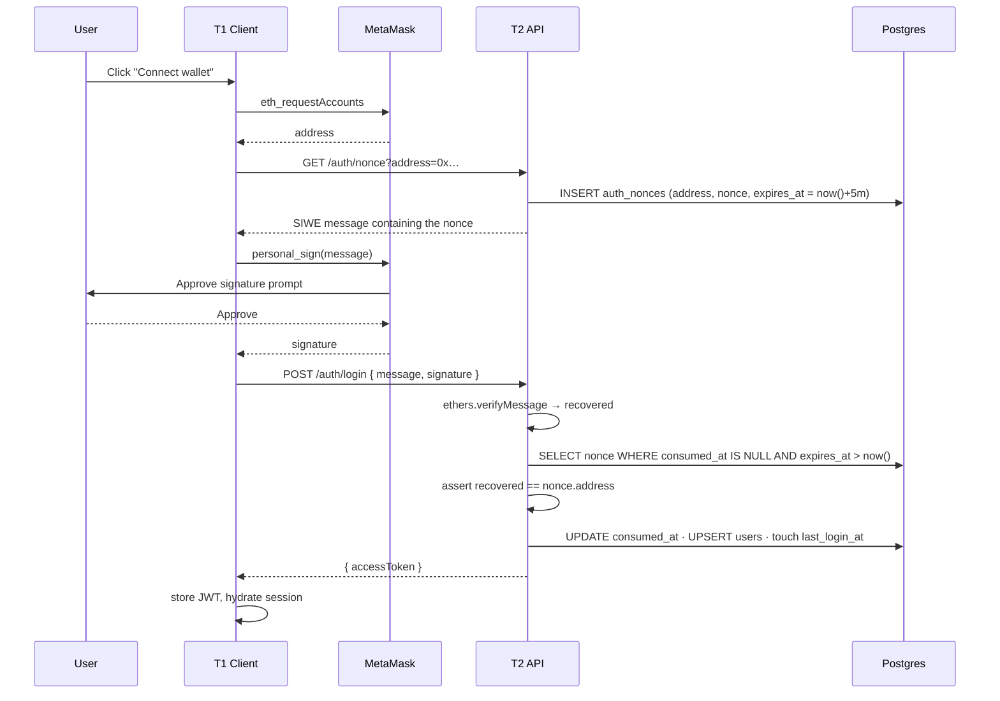

| # | Step | Owner | Task | State |
|---|---|---|---|---|
| 1 | Connect wallet, read address | T1 | — | ⬜ no wallet lib installed |
| 2 | `GET /auth/nonce` — random nonce, 5-min TTL, SIWE message | T2 | B4.1 | ⬜ |
| 3 | `personal_sign` in MetaMask | T1 | — | ⬜ |
| 4 | `POST /auth/login` — recover, compare, consume, upsert | T2 | B4.2 | ⬜ |
| 5 | Issue JWT · `JwtStrategy` · `JwtAuthGuard` | T2 | B4.3 | ⬜ |
| 6 | `GET /auth/me` | T2 | B4.4 | ⬜ |
| 7 | Expiry sweep for `auth_nonces` | T2 | B4.1 | ⬜ |

### The two rules that are cheap to get wrong

1. **Compare the recovered address to `auth_nonces.address`** — the address the nonce was
   *issued to* — never to an address in the request body. Reversing this is the classic SIWE
   hole: an attacker replays someone else's signature with their own address in the body.
2. **`consumed_at` is what stops replay,** not the TTL. Without it a captured signature is
   replayable for the rest of the 5-minute window. B9.4 makes "nonce replay rejected *inside*
   the TTL" a non-negotiable spec.

### Failure modes

| Condition | HTTP | What the user sees |
|---|---|---|
| No injected wallet | — | "Install MetaMask to continue" |
| User rejects the signature | — | Silent return to the connect state — not an error |
| Nonce expired | 401 | "Login request expired — try again" (client auto-retries once from step 2) |
| Nonce already consumed | 401 | Same message. **Never** hint that it was a replay |
| Recovered ≠ issued address | 401 | Generic "Signature did not match" |
| Wrong chain selected | — | Prompt `wallet_switchEthereumChain` to 80002 before step 2 |

---

## B — Upload & pre-check

Leg 1 of registration. Everything here is **free** — one chain view call and two computations —
and it all runs *before* the user is asked to sign and long before gas is spent.

**Entry:** `/upload`, step 1–2 of the wizard · **Auth:** JWT · **Writes:** `assets` (draft),
`asset_fingerprints`

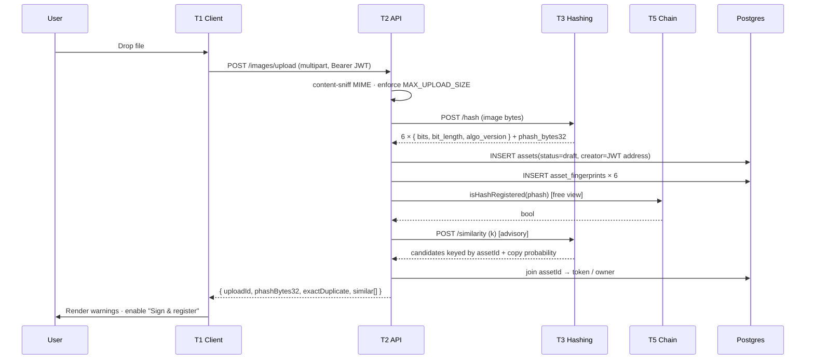

| # | Step | Owner | Task | State |
|---|---|---|---|---|
| 1 | `POST /images/upload` — multer, size limit, **content-sniff** | T2 | B5.1 | ⬜ |
| 2 | `POST /hash` → 6 hashes | T3 | BD.8 | ⬜ **endpoint does not exist** |
| 3 | Persist `assets(draft)` + 6 `asset_fingerprints` | T2 | B5.2 | ⬜ |
| 4 | `isHashRegistered(pHash)` — free view | T2 | B5.3 | ⬜ |
| 5 | `POST /similarity` — advisory | T3 | — | 🟡 exists, wrong key (see below) |
| 6 | Join candidates to `assets`, return | T2 | B5.2 | ⬜ |
| 7 | Render the duplicate/similarity verdict | T1 | — | ⬜ |

### Why the row is written before the token exists

`assets.id` created at step 3 is the same UUID v7 used as the `uploadId` handed to the client,
the `assetId` handed to T3 at index time, and the FK target for the saga row in Flow C. A crash
anywhere after this point is recoverable because the identifier already exists. This is
DESIGN.md §7's rule, and it is why `assets` has nullable `token_id`.

### Three things that corrupt this flow silently

- **`bit_length` is per-algorithm, not 64.** The benchmarks normalise over different
  denominators (DESIGN.md §7). Hardcoding 64 corrupts every downstream distance and **no
  backend test would catch it** — hence B9.4's third non-negotiable spec. The
  `asset_fingerprints_bits_match_length` CHECK in
  [init.sql](./prisma/sql/init.sql) catches a length/bits mismatch, but not a wrong-but-consistent
  constant.
- **Content-sniff, don't trust the extension.** A `.exe` renamed `.png` must be rejected
  (B5.1, B9.4 spec 2). T3 does this already via `Image.verify()`; T2 must not rely on that —
  the file reaches T2 first.
- **T3's `/similarity` keys on filenames it assigns itself.** It returns `image_name` and a
  self-assigned int `id`, neither of which joins to anything in T2. Until BD.8 lands the
  `assetId` contract, step 6's join is impossible. This is the single biggest external blocker
  in the system.

### Failure modes

| Condition | HTTP | What the user sees |
|---|---|---|
| File > `MAX_UPLOAD_SIZE` | 413 | "File exceeds 10 MB" — enforced client-side too |
| Not an image / disguised file | 415 | "That file is not a supported image" |
| T3 unreachable | 502 | "Hashing service unavailable — try again shortly". Never an axios stack trace (B2.3) |
| T3 timeout | 504 | Same, with a retry button |
| T3 model not loaded | 503 | Same |
| `isHashRegistered` → true | 200 | **Hard block.** "This exact image is already registered." Registering would revert at the contract after gas is spent |
| Similarity above threshold | 200 | **Advisory warning**, registration still allowed. Threshold is [open question §10.3](./DESIGN.md) |
| RPC down (step 4) | 200 | Degrade: return `exactDuplicate: null` and label the check as skipped. Do **not** fail the upload — the contract is still the real guard |

---

## C — Register a work (the mint saga)

Leg 2. **The only flow that writes to the chain**, the only one that spends gas, and the only
one that cannot be rolled back.

**Entry:** "Sign & register" · **Auth:** JWT · **Writes:** `mint_jobs`, `assets`,
`asset_signatures` · **Returns:** 202 + job id

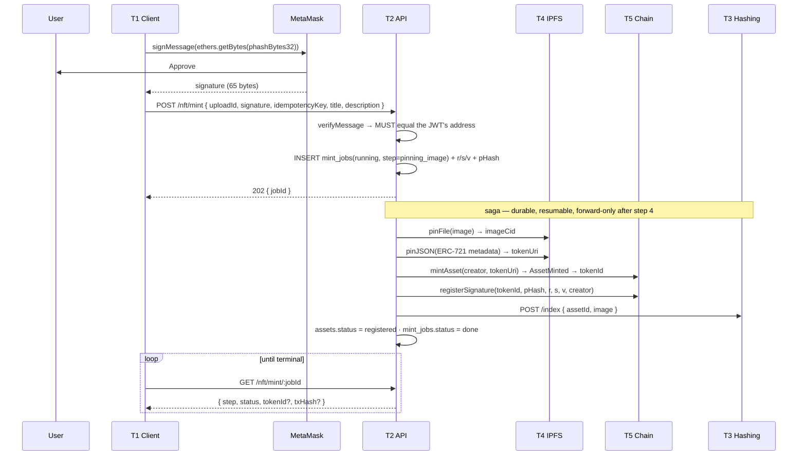

### The saga state machine

Six steps, not five — `indexing` is a real step (see [§0.4](#04-two-defects-in-the-current-wiring)).

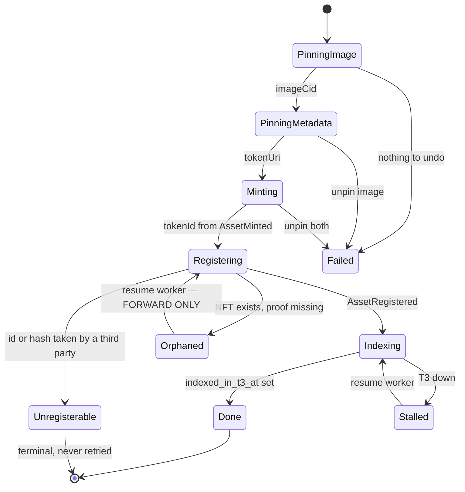

| # | Step | Owner | Task | State |
|---|---|---|---|---|
| 1 | Sign **the raw 32 bytes** in MetaMask | T1 | — | ⬜ no wallet lib |
| 2 | `POST /nft/mint` with `idempotencyKey` | T2 | B6.3 | ⬜ |
| 3 | `verifyMessage` locally, assert == JWT address | T2 | B6.2 | ⬜ |
| 4 | Pin image → pin metadata | T2/T4 | B3.1, B3.2 | ⬜ |
| 5 | `mintAsset()` → parse `tokenId` from `AssetMinted` | T2/T5 | B6.1 | ⬜ |
| 6 | `registerSignature(tokenId, pHash, r, s, v, creator)` | T2/T5 | B6.2 | ⬜ |
| 7 | `POST /index { assetId }` | T2/T3 | BD.8 | ⬜ |
| 8 | `unpin()` compensations | T2/T4 | B3.3 | ⬜ |
| 9 | `unregisterable` terminal state | T2 | B6.7 | ⬜ |
| 10 | Job-status polling endpoint | T2 | B6.3 | ⬜ |

### The signing format — get this wrong once and the asset is dead

```typescript
// CORRECT — the prefix length is 32, matching toEthSignedMessageHash(bytes32)
await signer.signMessage(ethers.getBytes(pHashBytes32));

// WRONG — signs the 66-char hex STRING, prefix length becomes 66
await signer.signMessage(pHashBytes32);
```

The wrong form produces a signature that passes every local check, is accepted on chain
(`registerSignature` does not verify signatures — DESIGN.md §8.1), **consumes the pHash slot
permanently**, and then fails every future `verifySignatureView`. There is no admin path to
undo it. The only recovery is a new image. B1.4 unit-tests this trap explicitly.

### Why T2 verifies the signature before submitting

`verifyMessage` costs nothing, and `registerSignature` performs **no** signature validation on
chain. T2's local check at step 3 is the only thing standing between a typo and a permanently
unverifiable asset. It must also assert the recovered address equals the JWT's address —
otherwise one user can register a work attributing authorship to another.

### Why the saga row is durable

Once `mintAsset` is mined the NFT is permanent and cannot be un-minted, so a failure at step 6
can only be rolled **forward**. `mint_jobs` carries `perceptual_hash`, `sig_r/s/v` as NOT NULL
precisely so the orphan state is dischargeable without asking the user to sign again — which is
the failure this table exists to prevent. Retry is safe by construction: `registerSignature`
reverts on a duplicate `tokenId` or `pHash`, so re-running a completed step is a no-op.

`idempotency_key` is client-supplied and stops a double-submitted upload from minting twice.
`_registeredURIs` alone does not prevent it — pinning identical bytes yields the same CID, so
the second attempt reverts at the contract, burning gas and surfacing an opaque error instead
of a clean 409.

### Failure modes — this is the table BD.7 needs most

| Step fails | Job state | Compensation | What the user sees |
|---|---|---|---|
| Signature ≠ JWT address | — (rejected before insert) | none | 400 "Signature does not match your wallet" |
| Duplicate `idempotencyKey` | — | none | 409 + the **existing** `jobId`, so a double-click is idempotent |
| Pin image | `failed` | nothing to undo | "Upload failed before anything was registered. Nothing was spent." Retry is a clean restart |
| Pin metadata | `failed` | unpin image | Same message |
| `mintAsset` reverts / out of gas | `failed` | unpin both | "Registration failed. Nothing was minted." |
| `mintAsset` mined, **`registerSignature` fails** | `orphaned` | **none — never roll back** | "Your NFT is minted. We're still attaching your proof of authorship." Show `tokenId`, keep polling. The resume worker (Flow D) discharges it |
| `registerSignature` reverts: id/hash already taken by a third party | `unregisterable` | none | "Your NFT is minted, but its proof slot was claimed by someone else and cannot be recovered." Link to the [§8.1 explanation](./DESIGN.md). **Never retried** — see below |
| `POST /index` fails | `stalled` | none | Registration is **complete and correct**; show success. Silently retry — the asset is simply not yet findable by similarity search (`indexed_in_t3_at` stays NULL) |

`unregisterable` is deliberately excluded from the `mint_jobs_resumable_idx` partial index in
[init.sql](./prisma/sql/init.sql) so the worker never spins on a job that can never succeed.
That is the whole difference between it and `orphaned`.

---

## D — Saga resume worker (background)

No user, no request. The reason `mint_jobs` is a durable table rather than in-memory state.

**Entry:** boot + interval · **Auth:** none · **Reads:** `mint_jobs_resumable_idx`

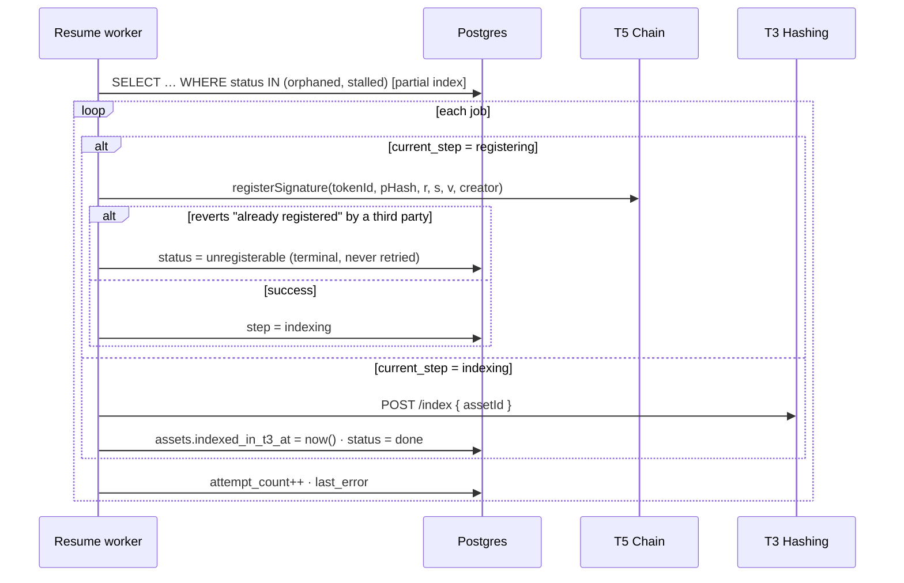

| # | Step | Owner | Task | State |
|---|---|---|---|---|
| 1 | Scan resumable jobs on boot and on interval | T2 | B8.3 | ⬜ |
| 2 | Roll `orphaned` forward through `registerSignature` | T2 | B8.3 | ⬜ |
| 3 | Classify a revert as `unregisterable` vs retryable | T2 | B6.7 | ⬜ |
| 4 | Retry `indexing` against T3 | T2 | B8.3 | ⬜ |
| 5 | Backoff on `attempt_count` | T2 | B8.3 | ⬜ |

**Forward only.** There is no path in this worker that burns, transfers, or otherwise undoes a
minted token. `orphaned` means the NFT is real and in the creator's wallet; the only missing
piece is its proof, and the signature needed to supply it is already on the row.

**Never retried:** `unregisterable`, `failed`, `done`. The first is terminal by contract
design — no admin function, no overwrite, no upgrade proxy exists to undo a hijacked slot.

---

## E — Verify ownership

"Was this image signed by this token's creator?" Free, live, public, and **never served from
Postgres**.

**Entry:** `/verify` · **Auth:** public (JWT optional — it only populates `requester_address`)
· **Writes:** `verifications`

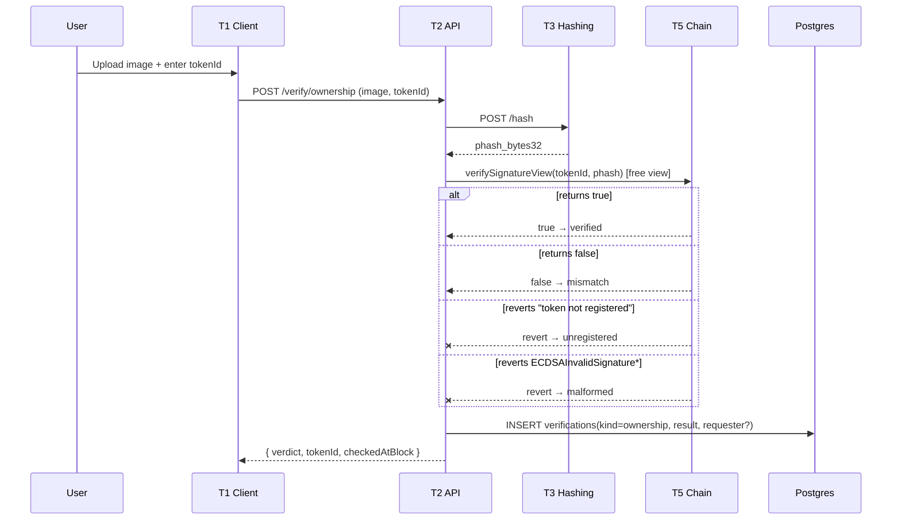

| # | Step | Owner | Task | State |
|---|---|---|---|---|
| 1 | `POST /verify/ownership` | T2 | B7.1 | ⬜ |
| 2 | `POST /hash` | T3 | BD.8 | ⬜ **missing** |
| 3 | `verifySignatureView` on the **read-only provider** | T2 | B7.1, B1.6 | ⬜ |
| 4 | Revert taxonomy → four verdicts | T2 | B7.1 | ⬜ |
| 5 | Persist the audit row | T2 | B7.4 | ⬜ |

### The revert taxonomy — four verdicts from two reverts and a boolean

`ECDSA.recover` in OpenZeppelin v5 **throws** on a malformed signature instead of returning
`address(0)`, and `getAssetSignature` reverts on an unregistered token. So this `view` can
revert, and ethers throws rather than returning `false`. Letting that surface as a 500 would be
wrong on every count — the call succeeded, the answer is just "no".

| Chain behaviour | Verdict | What the user sees |
|---|---|---|
| `true` | `verified` | ✅ "This image's hash matches token #N, signed by its registered creator" |
| `false` | `mismatch` | ❌ "This image does not match token #N" — the token *is* registered, the hash differs |
| revert `DAMSignature: token not registered` | `unregistered` | ⚠️ "Token #N has no registered proof of authorship" — **not** a failed verification |
| revert `ECDSAInvalidSignatureS` / `…Signature` | `malformed` | ⚠️ "Token #N carries a signature that cannot be recovered." Flag as suspect — this is the §8.1 griefing fingerprint |
| RPC unreachable | — | 503 "Cannot reach the chain right now." **Never** answer from `asset_signatures` |

### Two things this flow must never do

- **Never read `asset_signatures` for the verdict.** That table is a display cache. A verdict
  served from it would be a claim about our database, not about the chain.
- **Never render `creatorOf()` as proof of authorship.** `mintAsset` accepts an arbitrary
  `creator` with no access control, so anyone can mint a token attributing creation to any
  address. Only `verifySignatureView` is worth showing. Where `creatorOf()` and the registered
  signer disagree (DESIGN.md §8.3), render the **registered** one and flag the asset as
  suspect — `asset_signatures.signer_address` exists for exactly this comparison.

---

## F — Verify similarity

"Does this resemble anything already registered?" Entirely T3's answer; T2 joins and audits.
The most CPU-expensive call in the system.

**Entry:** `/verify` · **Auth:** public, rate-limited · **Writes:** `verifications`,
`verification_candidates`

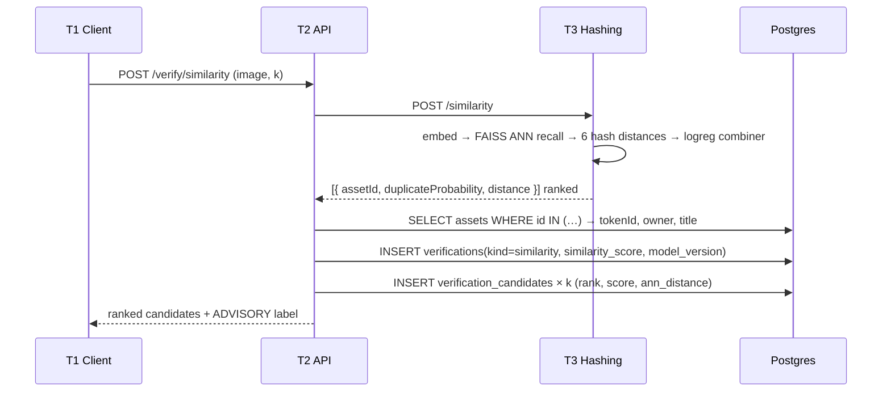

| # | Step | Owner | Task | State |
|---|---|---|---|---|
| 1 | `POST /verify/similarity` proxy | T2 | B7.2 | ⬜ |
| 2 | Two-stage recall + combiner | T3 | — | ✅ works |
| 3 | Key results on **`assetId`**, not filename | T3 | BD.8 | 🟡 **returns `image_name` + int id** |
| 4 | Join `assetId` → token/owner | T2 | B7.2 | ⬜ |
| 5 | Persist `similarity_score` **and `model_version`** | T2 | B7.2, B7.4 | ⬜ |
| 6 | Persist the ranked candidate list | T2 | B7.4 | ⬜ |
| 7 | Rate limiting | T2 | B0.10 | ⬜ |

### Why `model_version` is not optional

Retraining the combiner changes past verdicts. A dispute needs to know which model produced
which answer — an audit row without it records an opinion whose author is unknown. Same reason
`verification_candidates` stores the full ranked list rather than just the top score: "a search
happened and scored 0.91" does not say *what it matched*, which is the entire point of the log.

### Two scales that are easy to conflate

- `score` — copy probability from the logreg combiner, **[0, 1]**.
- `ann_distance` — raw squared L2 over unit-normalised embeddings, **[0, 4]**, *not* a
  similarity. Higher is less similar. Both CHECKs are in [init.sql](./prisma/sql/init.sql).
  The two stages can disagree, and a dispute may need to see that they did.

### Failure modes

| Condition | HTTP | What the user sees |
|---|---|---|
| T3 down / model not loaded | 502 / 503 | "Similarity search unavailable." No audit row |
| T3 returns an `assetId` we don't have | 200 | Candidate rendered without token metadata. `verification_candidates` has **no FK to `assets`** deliberately — the log records what was answered, not what is still true |
| No candidates above threshold | 200 | "No similar works found in the index" — labelled **advisory**, never "this work is original" |
| Rate limit hit | 429 | "Too many searches — try again in a minute" |

---

## G — Asset detail

One token, read live from the chain. Public.

**Entry:** `/assets/[id]` · **Auth:** public · **Writes:** none

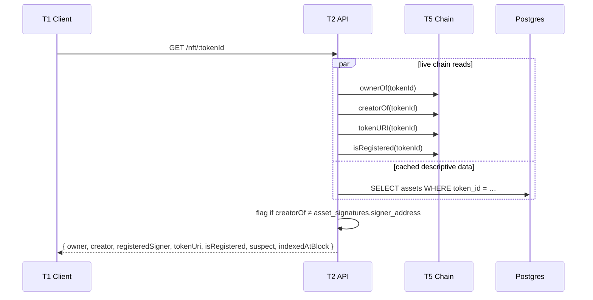

| # | Step | Owner | Task | State |
|---|---|---|---|---|
| 1 | `GET /nft/:tokenId` — four live reads | T2 | B6.4 | ⬜ |
| 2 | Join cached title/description/CIDs | T2 | B8.2 | ⬜ |
| 3 | Creator-disagreement flag | T2 | B6.4 | ⬜ |
| 4 | `GET /signature/:tokenId` — decoded, display only | T2 | B7.3 | ⬜ |
| 5 | Detail page | T1 | — | 🟡 renders `mock-assets.ts` |

**Ownership is read live, never from `assets.owner_address`.** That column is written by the
indexer only (Flow J) and is a projection — safe for lists, not for a single-asset assertion.
Where a cached value is shown, it carries `indexed_at_block`: that is the staleness contract
from DESIGN.md §1.

**`creatorOf` returns `address(0)` for a nonexistent token** rather than reverting, so a bare
`GET /nft/999999` must be distinguished from a real token by `ownerOf`, which *does* revert.

---

## H — Dashboard / my assets

The flow that justifies Postgres. `DAMAsset` is not `ERC721Enumerable` and `_creators` is
one-way, so **the chain physically cannot answer "list every token created by X"** — access
pattern A5 in DESIGN.md §7.1.

**Entry:** `/assets`, `/dashboard` · **Auth:** JWT · **Writes:** none

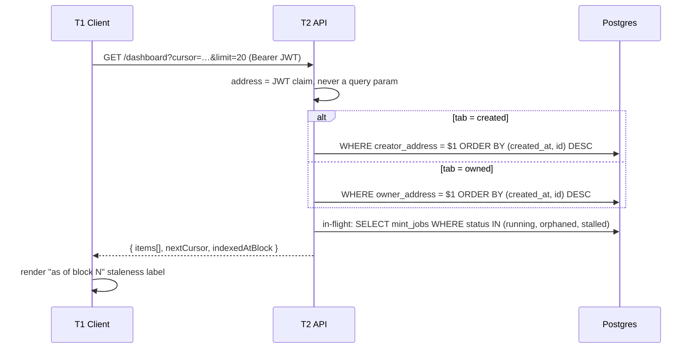

| # | Step | Owner | Task | State |
|---|---|---|---|---|
| 1 | Repository layer + `/dashboard` | T2 | B8.2 | ⬜ |
| 2 | **Keyset** pagination on `(created_at, id)` | T2 | B8.2 | ⬜ |
| 3 | In-flight jobs section | T2 | B8.3 | ⬜ |
| 4 | Staleness label | T1 | — | ⬜ |
| 5 | Asset grid / filters / search | T1 | — | 🟡 mocks |

Both tabs are served by dedicated composite indexes in
[schema.prisma:199-200](./prisma/schema.prisma#L199-L200). `id` is the keyset tiebreaker, not
decoration: without it, rows sharing a `created_at` force a Sort node on top of the index scan.
B8.2 requires `EXPLAIN` to show an index scan — **`OFFSET` pagination fails this task**.

The address comes from the **JWT claim**, never a query parameter. A dashboard that reads its
address from the URL is an enumeration endpoint for every wallet in the system.

---

## I — Transfer ownership

The one flow where **the client talks to the chain directly**, by necessity.

**Entry:** asset detail → "Transfer" · **Auth:** the wallet's own signature · **Writes:**
nothing synchronously

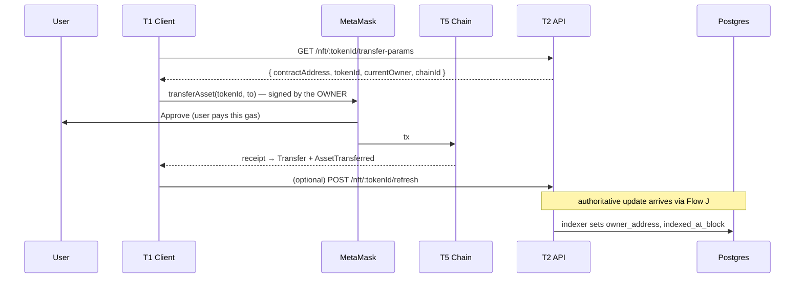

| # | Step | Owner | Task | State |
|---|---|---|---|---|
| 1 | Read-only params endpoint | T2 | B6.5 | ⬜ |
| 2 | Owner-signed transaction | T1 | B6.5 | ⬜ no wallet lib |
| 3 | Reconciliation from the `Transfer` event | T2 | B8.4 | ⬜ |

### Why the backend cannot do this for you

`transferAsset` requires `ownerOf(tokenId) == msg.sender`. **The service wallet is never the
owner** — `mintAsset` calls `_safeMint(creator, …)`, so the NFT lands in the creator's wallet
even though T2 paid the gas. For T2 to transfer, the owner would have to `approve()` the
service wallet, which is a custody model we should not want. So the transfer is the user's
transaction, paid by the user, and T2's only job is reconciliation.

**The user pays gas here** — unlike minting, where T2 pays. Worth saying in the UI, because the
asymmetry is surprising.

### Failure modes

| Condition | What the user sees |
|---|---|
| Not the owner | Button disabled; "Only the current owner can transfer this asset" |
| User rejects in MetaMask | Silent return |
| Tx reverts | Surface the revert string; the DB never changed, so nothing to repair |
| Tx mined, dashboard still stale | Expected. Owner updates when the indexer passes the ~30-block reorg lag — show "as of block N", not a spinner |

---

## J — Chain indexer (background)

The only writer of `assets.owner_address`. Keeps the projection honest, including for transfers
made on Polygonscan by wallets that never logged in.

**Entry:** boot + poll interval · **Auth:** none · **Writes:** `assets`, `asset_signatures`,
`chain_sync_cursor`, `processed_logs`

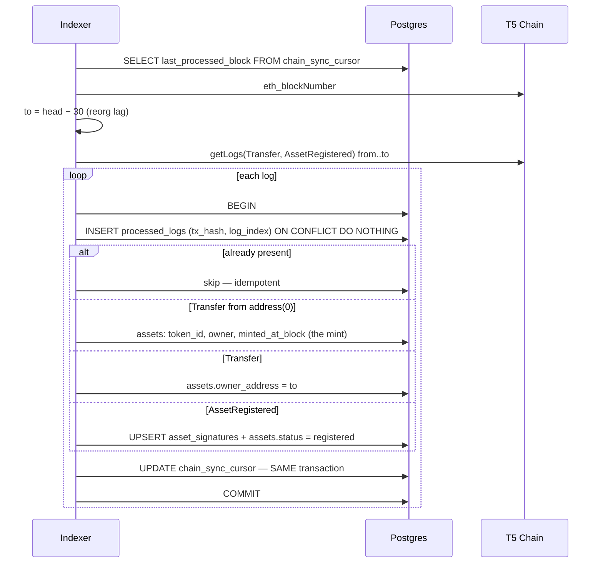

| # | Step | Owner | Task | State |
|---|---|---|---|---|
| 1 | Poll from the cursor with ~30-block lag | T2 | B8.4 | ⬜ |
| 2 | Index the **standard ERC-721 `Transfer`** | T2 | B8.4 | ⬜ |
| 3 | Index `AssetRegistered` → `asset_signatures` | T2 | B8.4 | ⬜ |
| 4 | Idempotency on `(tx_hash, log_index)` | T2 | B8.4 | ⬜ |
| 5 | Advance the cursor in the same transaction | T2 | B8.4 | ⬜ |
| 6 | Seed the cursor from env at boot | T2 | B8.4 | ⬜ |

### Index `Transfer`, never `AssetTransferred`

`DAMAsset` inherits the standard public `transferFrom` / `safeTransferFrom` and does not
override them. `transferAsset` is an *optional* wrapper and the only path emitting
`AssetTransferred` — confirmed by PoC. Every wallet, marketplace, and explorer uses the
standard functions. An indexer subscribed to `AssetTransferred` **silently misses most
ownership changes with no error anywhere**, which is the worst possible failure shape.

Indexing `Transfer` covers every path including `_safeMint` (from `address(0)`, which *is* the
mint), and makes `AssetMinted`/`AssetTransferred` redundant conveniences.

### Why `processed_logs` exists on top of the cursor

The cursor trails head by ~30 blocks to absorb reorgs, so the same log is **read many times
before it is final**, and a crash mid-batch re-reads it again. Convergent writes like
`owner_address = to` survive that by luck. Anything that INSERTs — an `AssetRegistered` landing
in `asset_signatures` — does not. Rows below the reorg horizon are prunable, which is what the
`blockNumber` index is for.

---

## K — Health & readiness

**Entry:** `GET /health` · **Auth:** public · **Writes:** none

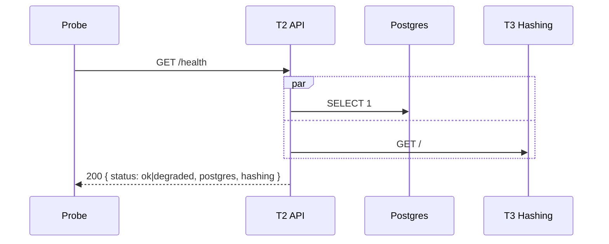

| # | Step | Owner | Task | State |
|---|---|---|---|---|
| 1 | Liveness + Postgres `SELECT 1` + T3 reachability | T2 | B0.8 | ⬜ |

**Report a degraded downstream in the body; do not 503 the whole app.** A T3 outage disables
Flows B, E and F but leaves A, G, H and I fully functional — collapsing that into a single
failed probe would take the app down for a partial outage.

---

## 3. Critical path

What has to happen before any of this runs, in order.

```
BD.8  T3 contract agreed  ─────────────┐   blocks B · C · E · F
BD.4  API contract published ──────────┤   blocks the entire frontend
                                       │
B0.1  NestJS boots  →  B0.9 Postgres up  →  B8.1 migrate
                                       ↓
        Epic 4 (A)   ∥   Epic 2 + Epic 3
                                       ↓
        Epic 5 (B)  →  Epic 6 (C, D)  ·  Epic 7 (E, F)
                                       ↓
                    B8.2 (H)  ·  B8.4 (J)
```

Three constraints worth restating because they are not obvious from the flows above:

1. **BD.8 is the largest external blocker.** Four of eleven flows need `POST /hash`, which does
   not exist, and Flow F needs `/similarity` re-keyed on `assetId`. `get_hash()` already exists
   in `hashing/utils/hash_utils.py` — exposing it is small, but it is not our code. T3 also
   cannot boot from a clean clone: `api/similarity.py` calls `joblib.load()` at import time on
   a model file that is gitignored and absent.
2. **The frontend has no wallet library.** Flows A, C and I are all blocked on it, and it is a
   dependency install plus a provider — not a design problem. Worth doing before BD.8 clears,
   since it unblocks nothing else and blocks three flows.
3. **Fix the T1→T3 direct call now**, not later. It is two lines today
   ([§0.4](#04-two-defects-in-the-current-wiring)); once the upload page grows state around a
   response shape T3 will never return, it stops being two lines.
